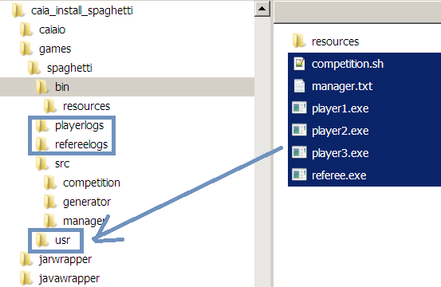

# caia-spaghetti-win64
## CodeCup 2022 caia spaghetti for Windows
#### (without Cygwin or WSL)
## General caia information
For the CodeCup 2022 spaghetti competition the CodeCup team has developed a caia package to test your program at home\
Caia isn't an abbreviaton, it's version 3 (***c***) first used in the CodeCup 2005 L***a***m***i***str***a*** game.\
The caia software contains source code for:
- caiaio
- manager

And compiled programs for:
- referee
- 3 test players

The main program for communication is called caiaio, see <https://www.codecup.nl/download_caia.php>  
The Cygwin compiled programs (referee and players) normally won't run on Windows, you'll have to use Cygwin or Windows Subsystem for Linux.  
A workaround exists by changing folder names and adding some Cygwin dll's (see below)  

To compile the caiaio source code you also need Cygwin or Windows Subsystem for Linux, since it uses Linux specific functions.  
I could not get it to run properly in Windows directly (on my Windows machines)
## win-caiaio
Therefore I've made a caiaio port for windows: win-caiaio  
Source code: (../win-caiaio)  

# Download caia_spaghetti_win64: caia spaghetti for Windows (64bit)
Download the spaghetti zip (caia_spaghetti_win64.zip), unpack anywhere and run `win-caiaio.exe` in the `spaghetti\usr\` folder\
The CodeCup team has developed a referee which logs the played games, so you can watch them afterwards in your browser\
(played games logs are in the `spaghetti\refereelogs\` folder)

### Do it yourself
(Download from the official sites and compile the sources)
#### CodeCup caia
- Download and unpack the spaghetti Cygwin / Cygwin64 version from the CodeCup site <https://www.codecup.nl/download_caia.php>
#### Add log folders
- Add 2 folders in the `spaghetti` folder (lower case)
  - playerlogs
  - refereelogs

#### Move programs (Cygwin workaround)
For the compiled referee and test players there's still a need for some Cygwin dll's  
Because the programs are not used as intended we also have to use a workaround.
- add a `usr` folder in the `spaghetti` folder
- Move the files in the `bin` folder to `usr`
- Compile the manager (`spaghetti\src\manager\`) and copy to `spaghetti\usr\` folder  

#### Cygwin dll's
To run the caia compiled programs (referee and test players) directly in Windows you'll need 3 dll's from Cygwin  
| dll                | Cygwin package |
|--------------------|----------------|
| cygwin1.dll        | cygwin         |
| cyggcc_s-seh-1.dll | libgcc1        |
| cygstdc++-6.dll    | libstdc++6     |
- Go to the Cygwin mirrors list <https://www.cygwin.com/mirrors.html> and choose a mirror
- Download the packages with the needed dll

For example:
Netherlands: <https://ftp.snt.utwente.nl/pub/software/cygwin/>  
- 64bit:
  - <http://ftp.snt.utwente.nl/pub/software/cygwin/x86_64/release/cygwin/cygwin-3.2.0-1.tar.xz>
  - <http://ftp.snt.utwente.nl/pub/software/cygwin/x86_64/release/gcc/libgcc1/libgcc1-10.2.0-1.tar.xz>
  - <http://ftp.snt.utwente.nl/pub/software/cygwin/x86_64/release/gcc/libstdc++6/libstdc++6-10.2.0-1.tar.xz>

- 32bit:
  - <http://ftp.snt.utwente.nl/pub/software/cygwin/x86/release/cygwin/cygwin-3.2.0-1.tar.xz>
  - <http://ftp.snt.utwente.nl/pub/software/cygwin/x86/release/gcc/libgcc1/libgcc1-10.2.0-1.tar.xz>
  - <http://ftp.snt.utwente.nl/pub/software/cygwin/x86/release/gcc/libstdc++6/libstdc++6-10.2.0-1.tar.xz>

Extract the dll's and place them in the `spaghetti\usr\` folder  

#### win-caiaio
- Download the source (../win-caiaio)
- Compile and copy the executable to the `spaghetti\usr\` folder
